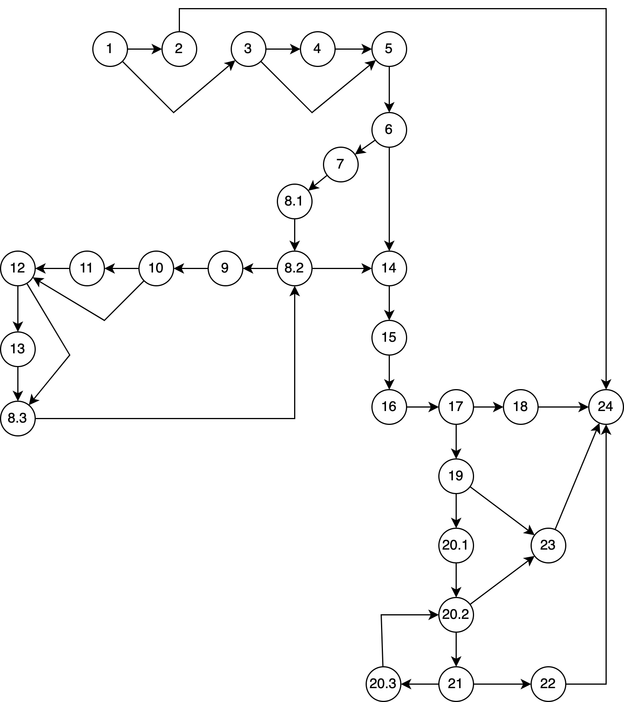

# Втора лабораториска вежба по софтверско инженерство

## Александар Атанасоски, 214020

### Control flow graph

### Цикломатска комплексност - 11
Според CFG има вкупно N = 28 јазли и E = 37 врски, па цикломатската комплексност ќе се пресмета според следната формула: 
Cyclomate complexity = E - N + 2 = 37 - 28 + 2 = 11

### Тест случаи според критериумот Every branch

....

### Тест случаи според критериумот Multiple condition

Ќе ја воведеме следнава синтакса:
X: user==null 
Y: user.getPassword()==null
Z: user.getEmail()==null

| XYZ	 | possible test case |	Branch |
|:-----|---------|--------|
| Txx	| u = null, p = password, e = name@email.com	| 1-2-24 |
| FTx |	u = user, p = null, e = name@email.com	| 1-2-24 |
| FFT |	u = user, p = password, e = null	| 1-2-24 |
| FFF |	u = user, p = password, e = name@email.com	| 1-3-5-… |

### Објаснување на напишаните unit tests
